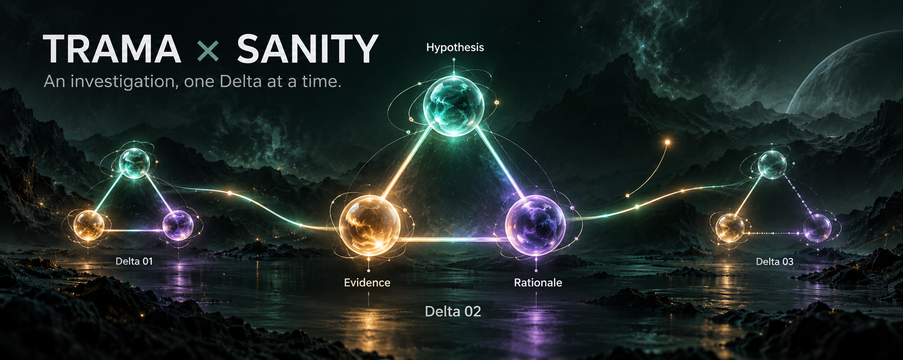

# Trama × Sanity

Conceptual cover art, not a screenshot of the current interface.

## Find the evidence. Test the story.

A release goes live. Checkout payments start failing. Was the deployment
responsible, was a provider slow, or is something else hiding in the records?

**You are the investigator.** Ask your own questions, follow the clues, and
inspect the Knowledge Base context behind each explanation.

Trama helps connect the evidence. Sanity's Knowledge Base helps find relevant
context in a noisy archive. The agent explains what the records support—and
what is still unknown.

## What can I do?

- Start with a short case brief.
- Ask a question or choose a suggested starting point.
- Read the answer alongside the complete Knowledge Base context it used.
- Follow up, challenge an explanation, and look for missing evidence.

Try: *“What changed shortly before the payment failures began?”*
Then ask: *“What evidence challenges that explanation?”*

The incident and archive are fictional. Knowledge Base entries are generated
summaries with source references, not independently verified originals. This
demo is read-only: it cannot change your personal data or apply an investigation
decision.

## Try it

[Open the hosted demo](https://trama.beautyqueenz.com/poc/sanity/investigate) ·
[Run it locally](docs/demo/README.md) ·
[Read the project story](docs/experiments/sanity-challenge-writeup.md) ·
[Walkthrough and submission checklist](docs/demo/delivery-one-checklist.md)

Sign in with the [public, restricted test account](docs/demo/test-access.md);
ordinary accounts cannot use the paid endpoint. Its 600-question total and
six-per-minute allowance is shared across all visitors, not granted per person.
Running your own instance requires authorized server-side credentials
and access to the pilot archive; cloning alone does not grant that access.

[Read the published Path One submission](https://dev.to/mateustalles/trama-investigating-uncertainty-with-sanity-context-2a9j).

## Build your own investigation

[Open the Delta game](https://trama.beautyqueenz.com/poc/sanity/game). Build a
hypothesis, choose evidence, explain your reasoning and preserve each decision
as a step you can later challenge or branch from. Its triangle connects
hypothesis, evidence and rationale; it does not score whether you found the truth.

Choose A/B/C around the hypothesis orb, select clues around the evidence orb,
and ask the model to propose a rationale using only your selected material.
Prewritten questions retrieve new clues from Sanity without first generating
an answer. You decide what to accept and can later return, contest or branch.

Six frozen source excerpts provide a starting point; native KB Search adds
clearly labeled generated response sections, not verified originals. The
notebook stays in your browser, not in real Trama State.
[Game walkthrough and limits](docs/demo/game.md) ·
[Game source](apps/web/app/poc/sanity/game) ·
[Path Two submission template](docs/experiments/sanity-challenge-game-submission.md).

## How do we know it works?

We test the retrieval and answer-handling safeguards with fixed examples,
evaluate real model behavior separately, and manually check whether the
sources support important claims. These are different checks: a passing unit
test is not proof that every AI answer is correct.

[How we test the agent](docs/testing.md) · [Browse the tests](__test__/README.md)

## For builders

[Setup and walkthrough](docs/demo/README.md) ·
[Retrieval architecture](docs/experiments/sanity-live-agent-demo.md) ·
[Archived research and benchmark notes](docs/experiments/sanity-challenge-research-notes.md)

Please do not submit personal or confidential information. Questions are sent
to Sanity and OpenAI, and live investigations may incur provider charges.
