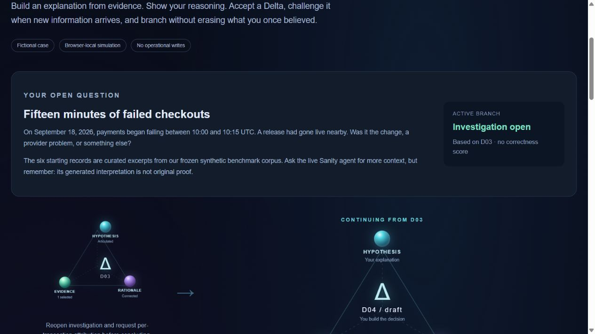
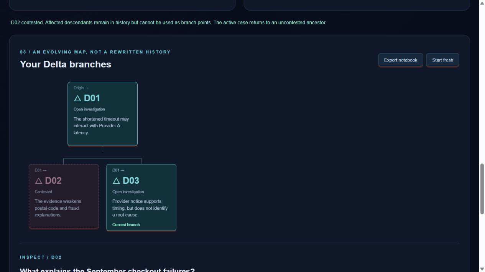

# The Delta investigation game

Status on October 4, 2026: [the game is deployed](https://trama.beautyqueenz.com/poc/sanity/game)
with HTTPS and restricted access. Local production-build interactions and the
hosted restricted-judge HTTP page were checked separately. Password-based
browser sign-in and optional live retrieval through the game browser remain
untested; do not treat the separate [agent](README.md) smoke as those checks.

## Your challenge

Payments failed during a fifteen-minute checkout incident. A release happened
nearby, several teams left records and an older outage mentions the same
provider. Form your own hypothesis, connect it to evidence and state what you
can conclude without turning an inference into certainty.

The six starting records are curated excerpts from the frozen synthetic corpus,
not the entire 145-document archive or newly retrieved originals. They are
available immediately: this is a decision-building prototype, not a puzzle
that hides every clue until you unlock it. There is no hidden answer key,
root-cause oracle or percentage-correct score.

## Play the investigation

1. Read the brief and open records in the **Evidence notebook**. Select material
   that supports or challenges the explanation you want to test.
2. In **Build your next Delta**, write the open question, your hypothesis,
   rationale and qualified conclusion. At least one notebook item is required.
3. Choose **Accept my Delta**. The accepted step moves to the smaller triangle;
   a fresh draft appears in the large triangle. The three orbs represent
   hypothesis, evidence and rationale, not a truth score.
4. Accept a second step, then inspect the first in **Your Delta branches**.
   **Return here & build a branch** keeps later steps and lets your next accepted
   Delta grow from that earlier point.
5. To challenge a decision, enter a reason and choose **Contest this Delta /
   preserve history**. The contested step and descendants remain visible, but
   they cannot anchor a new active branch. The active path returns before the
   contested assumption if it was affected.
6. **Mark this branch concluded** is your decision, not proof of a solved case.
   Accept another Delta without that mark to reopen the line of inquiry.

The validator checks required fields and valid references. A complete Delta
can still be wrong. The player decides what to accept; the model does not
write, approve or contest game steps automatically.

Local production-build capture: the accepted step is smaller, and the next
draft is central. This capture was taken locally, not on the hosted URL.

Local production-build capture: contesting D02 preserves it and the active
sibling branch D03.

## Bring Sanity into the investigation

Expand **Ask Sanity for another clue**, write a question and ask the live agent.
It uses the same native KB Search → full generated context → OpenAI route as
the read-only demo. Questions are sent to Sanity and OpenAI and consume the
same restricted demo quota. No personal or confidential information should
be entered.

Read the answer, limitations and complete returned context. **Keep generated
context in notebook** stores that material locally, with a label distinguishing
it from the frozen synthetic source excerpts. You must select it yourself
before using it in a Delta. A reference in generated context is not independent
verification of the underlying original, and adding it does not prove a claim.

The six frozen items require no live provider call. Live access requires the
approved judge or operator account and configured server credentials; the game
does not ask visitors to enter API keys. It does not create a KB per player or
write game progress to Sanity.

## Save and reset

Accepted Deltas, events and kept evidence are saved to this browser's local
storage when available. Unaccepted drafts and unkept live results are not saved.
The notebook is not account-scoped or encrypted: people using the same browser
origin can encounter the same local notebook. Clearing browser data removes it.

Use **Export notebook** to download JSON before leaving or resetting.
**Start fresh** shows an inline export-first warning. **Keep notebook** cancels
without changing the notebook; **Reset local notebook** explicitly confirms
the reset. This does not delete Trama, Supabase or Sanity data. There is no JSON import control in
this MVP. If local storage is unavailable, play can continue, but export is the
way to retain the accepted history.

## Record the second delivery

Show D01 accepted → D02 draft, with the orbs and transition. Ask Sanity one real
question, keep its complete generated context, and manually build the next
Delta. Then return to D01, create a different branch and contest an unsupported
assumption without deleting history. Finish by exporting the notebook and
explaining the completeness-only feedback.

The Path Two submission needs a verified deployed game link plus a video or
screenshots. The protected deployed game link and local production screenshots
are included above. Keep the first-delivery
agent writeup separate; use
[the game writeup draft](../experiments/sanity-challenge-game-writeup.md) for
the second post after validation.

## Validation recorded so far

The integration passed 242 offline tests (167 Vitest and 75 Node script tests),
workspace typecheck and the local production build. In that running build,
the browser walkthrough accepted D01, concluded D02, returned to D01, accepted
the open sibling D03 and contested D02 without changing the active D03 branch.
Reload restored D03 and its five-event history. A 375-pixel viewport had a
375-pixel document width in the responsive check.

The Linux production build also passed. The R3 deployment used source
commit `e1112cb`. A real restricted-judge HTTP session returned game page 200;
anonymous access redirected with 307. Game POST and unrelated operational API
requests returned 403. A call to the shared native investigation API returned
200 with all 14,093 context characters, 3,916 input and 268 output tokens,
and 6.119 seconds total latency. This verifies the shared API via HTTP, not
the game's browser controls for keeping and selecting live context.

All six starting excerpts were compared paragraph by paragraph with the frozen
corpus: six checked, zero mismatches. This verifies those shipped excerpts,
not current live KB source coverage or independent claim support.

The optional provider request has not yet been exercised through the game
browser. Although the export automation's event wait timed out, its actual
download was found and parsed: version 1, head D03, three Deltas, five events
and six evidence items. Export therefore has an output-based verification.
The initial native reset dialog blocked browser automation. It was replaced
with the explicit inline confirmation above; the final offline regression
passed 243 tests (168 Vitest and 75 Node tests), typecheck and build, including
a reset guard that preserves the original notebook until confirmation. The
new inline controls have not yet been verified end-to-end in that browser.
Password-form testing and private credential
handoff also remain pending. The separate agent's live results do not
substitute for those checks.

The final R4 application release uses commit `2740343`, preserving R3 for
rollback. Its Linux build passed and a new restricted-session route check
returned game page 200, anonymous redirect 307, and game/operational writes
403, without another model call. The inline reset controls remain a manual
browser check; neither release changes authoritative Trama State.
