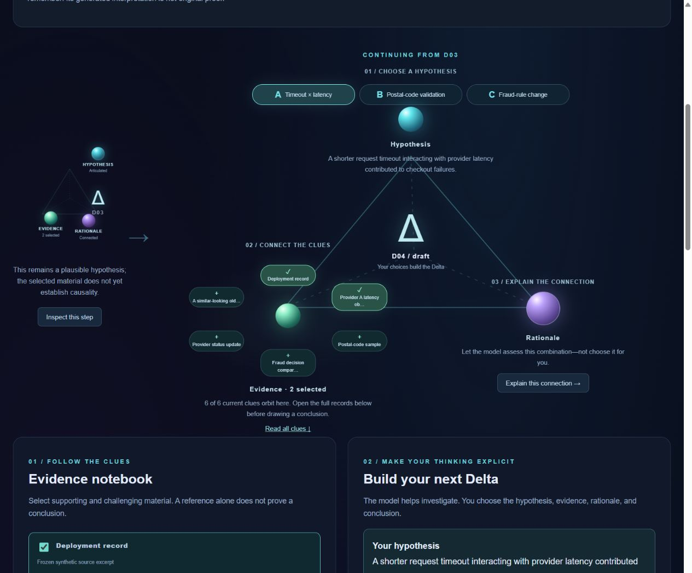
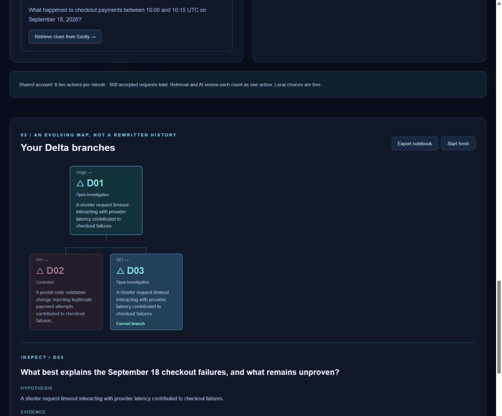

# The Delta investigation game

[Open the game](https://trama.beautyqueenz.com/poc/sanity/game) ·
[Restricted test login](test-access.md)

## Your challenge

A release went live near fifteen minutes of failed checkout payments on
September 18. Choose an explanation, look for supporting and challenging
material, and decide how much the evidence actually establishes.

This is a fictional reasoning board, not a hidden-answer puzzle. Six curated
excerpts from the frozen synthetic corpus are available immediately. The
existing Sanity KB can add more context without rebuilding anything per player.

## Play

1. Choose hypothesis **A**, **B** or **C** around the cyan orb: timeout and
   latency, postal-code validation, or a fraud-rule change. The choice is yours.
2. Click clues around the green orb. Open **Read the record** in the notebook
   to inspect the full text. Selecting a clue is not proof that it supports you.
3. Under **Ask a question. Find clues.**, choose a predefined investigation
   question and **Retrieve clues from Sanity**. This sends its declared search
   terms to native KB Search. It adds returned context without selecting it for
   you or asking OpenAI to answer the question.
4. Select at most ten clues and click the purple orb or **Explain this
   connection**. OpenAI proposes a rationale, limitations and a next check
   using only those selected clues. It may report support, partial support,
   contradiction or insufficient context—not a percentage-correct score.
5. Read the proposal. **Use this rationale in my Delta** adopts its text;
   **Dismiss proposal** rejects it. A cautious local template is also available
   without a model call. Changing your hypothesis or selection clears the old
   proposal and draft rationale.
6. Choose **Best supported**, **Still plausible** or **Not enough evidence**.
   Optionally mark the branch concluded. Then **Accept my Delta** preserves
   your step and opens a new draft. The model never accepts it automatically.
7. Inspect a past Delta. **Return here & build a branch** keeps its descendants
   and lets your next step grow from that earlier point. Enter a reason to
   **Contest this Delta / preserve history**; affected descendants remain
   visible but cannot anchor a new active branch.

A concluded branch can reopen through another Delta. A complete Delta can
still be wrong: field validation checks completeness, while AI review checks
support in the selected material, not the truth of the entire archive.

Hosted R7 capture: hypothesis alternatives, selected orbiting clues and the
optional rationale action. These are actual controls, not conceptual artwork.

## What Sanity actually returns

The native route uses the existing `kbkpWkNaMVN6` KB, `return: entries`,
and `limit: 5`. It does not fall back to local keywords or rerank sources.
The recorded native output is one Markdown text containing several generated
sections. We split only the explicit horizontal-rule/top-level-heading
boundaries into presentation cards. All characters are retained; joining the
cards reproduces the full response. The full response and exact query remain
inspectable. These are **generated response sections**, not verified originals
or invented native document IDs. A section can reference several source files.

Each live card carries a server-authenticated receipt valid for eight hours.
Changed or expired cards cannot enter AI review: retrieve them again. Frozen
records resolve from server-owned text, not a client-supplied replacement.
Reviews reject references outside the selected set and use a strict JSON schema.
Neither mechanism independently verifies factual claims or prevents every
possible model misinterpretation.

The notebook holds at most 60 items and 200 Deltas. Oversized responses or
reviews fail explicitly rather than silently clipping context. The triangle
shows up to eight current clues; all retained cards remain in the notebook.

## Live allowance and privacy

Retrieval and AI review each count as one accepted live action. They share the
restricted account's **six actions per minute / 600 total** allowance with the
Investigator. Reading, selecting, accepting, branching and exporting are local
and free. The UI shows remaining allowance and precise retry countdowns.
Search and generation have separate 30- and 90-second server deadlines. A
timeout is not a quota cooldown; accepted failed attempts still count. There
are no automatic provider retries.

Provider keys remain server-only. Do not enter personal data. Selected context
is sent to OpenAI only when requesting a rationale; retrieval goes to Sanity.

## Save, export, reset

Accepted Deltas, events, clues and receipts use the existing version-1 browser
notebook. Earlier valid notebooks remain readable. Drafts and pending review
proposals are not persisted; accepted rationale text is.

Browser storage is not account-isolated or encrypted. Shared devices share
this notebook. Export JSON before leaving or using **Start fresh**. Reset
requires an explicit inline confirmation and does not delete server, Sanity,
Supabase or operational Trama data. There is no JSON import control.

## Delivery boundary

This is a browser-local simulation of reversible reasoning, not an operational
Trama State engine, Sanity Workflow or multi-user investigation system. No
game action applies a real Delta or modifies the KB. The model offers an
evidence-support assessment, not a root-cause oracle or audited win condition.

See [implementation decisions](guided-delta-game-plan.md) and the
[Path Two writeup draft](../experiments/sanity-challenge-game-writeup.md).

## Validation record · October 5, 2026 UTC

277 offline tests passed (193 Vitest / 84 script tests), workspace typecheck
and Windows/Linux production builds passed. In a local production browser,
D01 → concluded D02 → return D01 → sibling D03 → contest D02 retained all
three Deltas and restored active D03 with five events after reload.

Hosted R6 (`9ed6f1a`) retrieved five complete generated sections through the
game browser. A separate OpenAI review of three selected records—including a
live authenticated KB section—returned a supported proposal in 5.3 seconds,
with causal limits and only selected references. The draft rationale remained
empty until explicitly adopted. The player then accepted D01 and opened D02.
Anonymous game access redirected (307), unsigned review returned 401 and an
operational write returned 403. No dataset, KB or operational State changed.

R7 (`e150674`) fixed inherited full-width checkbox styles. The hosted
375-pixel viewport then had a 360-pixel document width, with no horizontal
overflow. The hosted walkthrough also branched from D01, contested sibling
D02 and restored active D03 with five events and eleven notebook items after
reload. An unsupported postal-change selection returned **contradicted** in
3.6 seconds and did not invent a rationale supporting that hypothesis.

Export produced a parsed version-1 notebook with head D03, three Deltas,
five events, eleven evidence items and contested D02. The browser automation's
download-event wait timed out, but the actual downloaded file was inspected.
Cancelling hosted reset preserved the notebook; explicit local reset restored
the six starter clues and empty history after reload.

These are behavior/provenance checks, not independent certification of every
claim. The previous application releases remain available for rollback.
